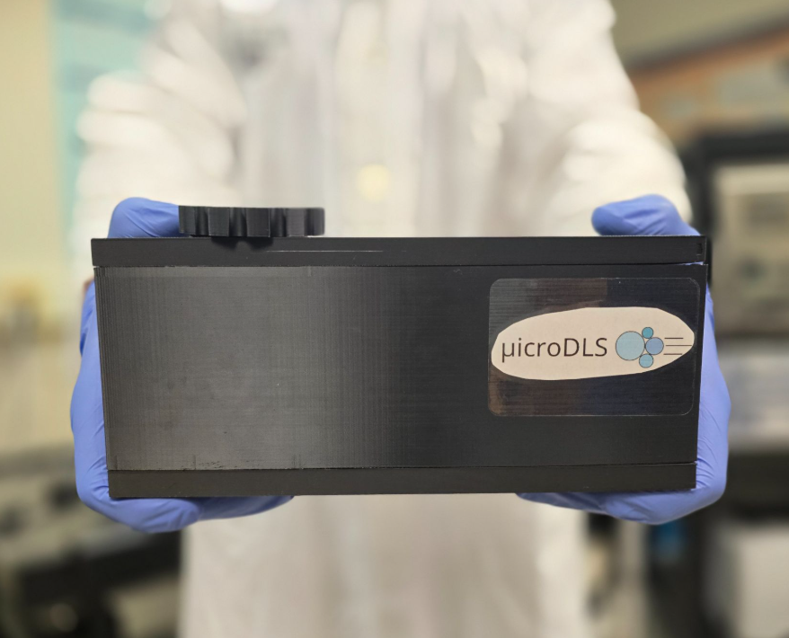
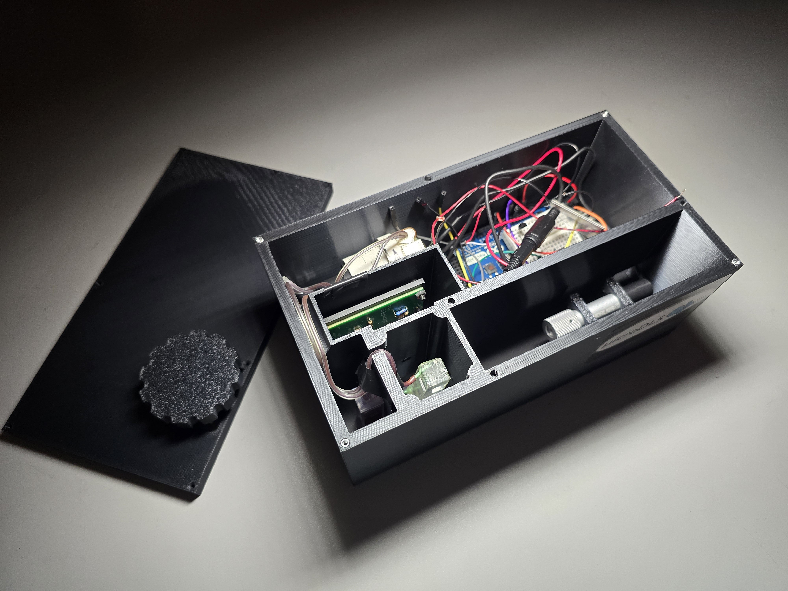

# μicroDLS Application

## About the Project
Efficient real-time monitoring and control of nanoparticle synthesis in laboratories remains challenging, limiting advancements in pharmaceuticals and energy storage. Our solution, the µicroDLS, is a miniaturized characterization device that enables real-time particle size measurements during reactions by integrating dynamic light scattering (DLS) with a chip-based in-situ fluid flow system. It leverages lab-on-chip capabilities to streamline workflows and enables easy in-situ particle size measurements, reducing characterization time and complexity while providing deeper research insights.

The poster containing more detailed information about the design, solution, and results is available in [`µicroDLS.pdf`](./µicroDLS.pdf).






## Application Overview
This repository contains the application code that communicates with an Arduino  measurement system, processes the data, and presents results through a user interface.

To run: 
```bash
python DLS_app.py
```

The µicroDLS app:
- Accepts user input for measurement interval and total measurement time
- Displays real-time voltage readings from the detector and temperature sensor
- Computes particle size distribution from collected data
- Facilitates easy data download of ddata for users
- Includes safety features, such as automatic laser shuts off when the lid is opened

### Files & Directories:
- `DLS_app.py`: Main application script to launch the UI and begin measurements  
- `connect_arduino.py`: Handles communication between the app and the Arduino  
- `upload_DLS/upload_DLS.ino`: Arduino firmware for data acquisition  
- `data_processing/`: Contains all the scripts related to data analysis and particle size distribution calculations  


## Data Processing
The data analysis approach is adapted from the open-source tool [Raynals](https://spc.embl-hamburg.de/app/raynals): https://github.com/osvalB/dynamicLightScatteringAnalysis. Their code was incredibly helpful in the development of this project!


## Acknowledgements
Special thanks to [PolarBearJ](https://github.com/PolarBearJ) for developing the data processing code and optimizing the Arduino's sampling rates!